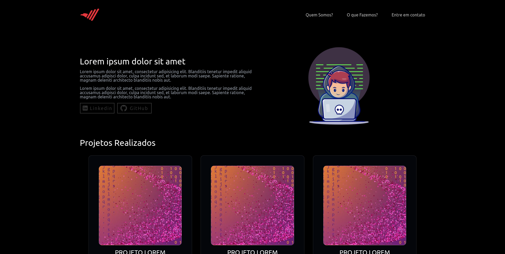

# Código Certo - Landing Page Project

This is a [Landing Page]() for Código Certo Community. Exercise proposed by [Código Certo]() in the Front-End Developer course.

## Table of contents

- [Overview](#overview)
  - [Objective](#Objective)
  - [Screenshot](#screenshot)
- [My process](#my-process)
  - [Built with](#built-with)
  - [Guide](#Guide)
- [Author](#author)

## Overview

### Objective

Develop my experience with HTML, CSS end JS, improving my knowledge and learning new features.

### Screenshot

## My process

### Built with

- Semantic [HTML5](https://developer.mozilla.org/pt-BR/docs/Web/HTML) for markup.
- [CSS](https://developer.mozilla.org/pt-BR/docs/Web/CSS) For custom properties.
- [JS](https://developer.mozilla.org/pt-BR/docs/Web/JavaScript) For interactivity.

### Guide

- Download the repository.
- Double Click in index.html.

## Author

- LinkedIn - [Lucas-Gabriel](https://www.linkedin.com/in/lucasdevtec/)
